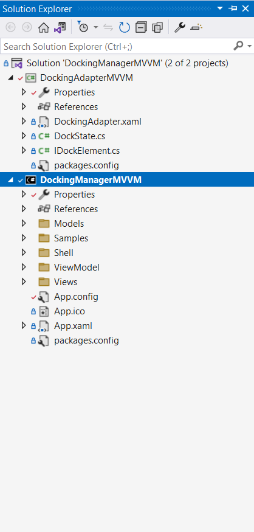

# Working with WPF DockingManager and MVVM
## MVVM
This section explains how to adapt the Syncfusion docking manager to an MVVM application. Since the WPF DockingManager is not an Items Control, it is not possible to have a traditional ItemsSource binding to a collection of objects in the view model. However this can be achieved by creating a wrapper or adapter for the DockingManager.

1. DocumentsView - The pane that lists all the available documents and tooltip display the path of the document.
2. PropertiesView - The pane that shows the properties of a document. Our PropertyGrid control is used here.
3. DocumentView - The pane that uses the WPF flow-document reader to display the content of a file.
4. CommandView - The view has two commands: Open Document and Exit. Executing an Open Document action opens the Open File Dialog. The document that opened, added to the existing documents list. Other commands like Close Document and New Document can also be implemented the same way.
5. The project structure looks like this:

## Docking Adapter
The adapter is simply a user control that contains DockingManager as its content. The adapter has two properties — ItemsSource and ActiveDocument. Binding a collection of objects to the ItemsSource property triggers a collection change where the adapter creates a corresponding Framework element, example: ContentControl in the DockingManager, setting the underlying data context of the control to the business model.

## C#

    <mvvm:DockingAdapter ItemsSource="{Binding Workspaces}" ActiveDocument="{Binding ActiveDocument,Mode=TwoWay}">
    </mvvm:DockingAdapter>

For more details please refer [DockingManager and MVVM](https://help.syncfusion.com/wpf/docking/pattern-and-practices#mvvmlight)